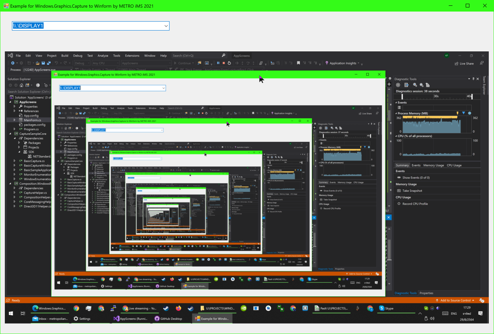

# AppScreens
 Windows Screen Capturing Example
 
## About the project
 
 Example project for legacy Winforms compatible by interpolating DXGI and Windows.Graphics.Capture frameworkk 
 
 
  
## Prepare your environment

Minimum requirements for using the Visual layer in desktop apps are listed here. Individual samples might have different requirements, which are listed in the readme for the sample.2

- Visual Studio 2017 or later - [Get a free copy of Visual Studio](http://go.microsoft.com/fwlink/?LinkID=280676)
- .NET Framework 4.7.2 or later
- Windows 10 version 1803 or later
- Windows 10 SDK 17134 or later

## Dependencies

- Microsoft.Windows.SDK.Contracts
- SharpDX 4.2.0
- SharpDX.Direct3D11  4.2.0
- SharpDX.DXGI 4.2.0
- System.Numerics.Vectors 4.5.0

## Tools required to develop

 - [Visual Studio](https://www.visualstudio.com/)
 - [WiX](http://wixtoolset.org/releases/v3.9/stable) - to generate the installer (optional)
 - [7-Zip](http://www.7-zip.org/download.html) - to generate a zip version of the tool (optional)

## Contributing

If you want to contribute to the project, send an issue on Github.

